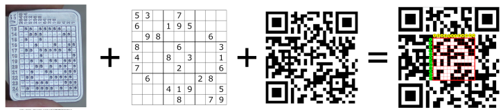
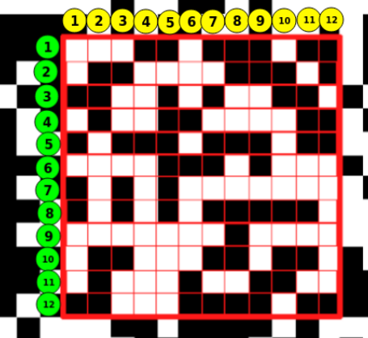
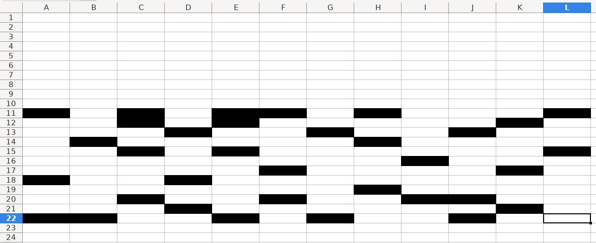

### 🔐 QRpicoSeed
#### A multisig approach using just one QR code.



---

### ℹ️ First words:

1. We can take those patterns from different parts of the QR code, and not just from a square.
1. The idea of having multisig is that we can modify certain parts of a QR code to add whatever we want. Even a image on it... 


There are QRs that contains images in the middle of the QR itself, and we are able to scan it anyways. That is because of high error correction level.

Take look at this image that takes 19x19 boxes:


---



As you can see in this exmaple. We have 12x12 (and we can mix up/down or left/right)

We could have the axis numbers and names like a spreadsheet to be able to save the coordinates very easily, like:
[A11:L11]
[A22:L22]



Take in account that we can take from the last image example seeds from UP/DOWN (11-22) and LEFT/RIGHT (A-L) ! :)

#### 🧮 A quick example creating seeds:

- 1 abandon = ⬜️⬜️⬜️⬜️⬜️⬜️⬜️⬜️⬜️⬜️⬜️⬛️
- 2 ability = ⬜️⬜️⬜️⬜️⬜️⬜️⬜️⬜️⬜️⬜️⬛️⬜️
- 3 able    = ⬜️⬜️⬜️⬜️⬜️⬜️⬜️⬜️⬜️⬜️⬛️⬛️

---


### 📝 Ideas from this:

1. Create a QR based in our passphrase, for example "https://desobedientetecnologico.com". So from that QR we can take our seeds from different coordinates and use that passphrase too.
1. Write down somewhere the coordinates like this example for a square of 12x12, without been scare if someone see it: 
```
[a11:k11]
[a22:k22]
```
1. Finding randomly 11 or 23 seeds in a row, writing down coordenates and let the SeedSigner calculate the last words.

...


---
### 💡 Do you like this idea and others I have?
##### ☕️ You can support this project, future projects or just invite me a Coffee by <a href="https://lntxbot.com/@desobedientetecnologico">⚡️ LN</a> or ⛓ On-Chain (Send me Twitter DM or Telegram)
---
